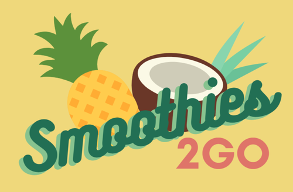

# Smoothies2Go Project

The Smoothies2Go is a mockup project to help the any Smoothies Cafe' clients to pre-order online and pickup Smoothies on the Go. This is an effort to promote the business and sales of joints by encouraging their clients and customers to pre-order and pick their items on the go. This will save the customer's time, and also support social distancing in the Corona Pandemic situation. The idea is to expand the project to make it a cheaper option to DoorDash, UberEats and Grubhub and save restaurant owners and joint owners the high commission charges (approx. 20% commission per order) which cuts down on their profits.

### About Project

- Frontend Repo deployed in netlify

  [Website Live](https://smoothies2go.netlify.app/)

  Technologies - React, MBBootstrap, Axios, Stripe

  References

        - [MDBootstrap Components](https://mdbootstrap.com/docs/react/getting-started/quick-start/)
        - [MDBootstrap eCommence Template](https://mdbootstrap.com/freebies/jquery/e-commerce/)
        - [Stripe](https://stripe.com/docs/checkout/integration-builder)

- Backend Repo deployed in Render (since Nov, 20 2022) - Migrated from Heroku (since Nov 17 2020) after it became paid service 

  [Backend App](https://smoothies2go-express-backend.herokuapp.com)

  [Backend Repo](https://github.com/sampreet-chawla/smoothies2go_express_api)

  Technologies - Express, MongoDB, Stripe

  It provides Backend APIs for Smoothies2go, and also acts as Stripe Payment Server

## Smoothies2Go Frontend

This repo contains the frontend code for the Smoothies2Go Project. It was bootstrapped with [Create React App](https://github.com/facebook/create-react-app).

<!-- ### Wireframe

* [Mobile Layout](https://res.cloudinary.com/dreamer123/image/upload/v1605822175/Capstone/Fresh-To-Go_-_Mobile_Layout_rjwwyx.png) -->

### React Architecture Diagram

- [React Architecture Diagram Link](./docs/smoothies2go_react_architecture.png)

<!-- - Learning - Anchor tag does not open the specified href in a blank page  -->
<!-- - <a href="./docs/smoothies2go_react_architecture.png" target="_blank">React Architecture Diagram Link</a> -->

<!-- ### Notion

[Notion Link](https://www.notion.so/Smoothies2Go-planning-1cfe62a022084da4bb7fa08bb1222e43) -->

### MVPs and Post MVPs

- #### MVPs - Completed

  - Project Planning and Documentation
  - Setup repos with folder structure
  - Initial Deploy to heroku and netlify
  - NodeJS / Express Backend with MongoDB database setup
  - Model built-up
  - Controller built-up
  - Seed mongodb with items
  - MDNavbar Navbar Integration
  - Header Integration
  - Menu Display with Categories
  - Add to Cart
  - Edit and Delete From Cart
  - Checkout Cart
  - Confirmation Page
  - CSS Styling and Responsive Layout

- #### Post-MVP

  - Stripe Payment Integration - Completed
  - User Signup, Login and Logout - Completed
  - Search bar - To be done
  - Edit Profile = To be done
  - My Orders - To be done
  - Framer Motion / Animation - nice to have
  - SASS/SCSS Styling - nice to have
  - Update Documentation - Ongoing, completed for current code
  - Code Cleanup - Completed for current code

### Libraries

- React routers and hooks
- Axios for backend API calls
- Stripe for Stripe Integration
- MDBootstrap for Navbar, Card display, Sign Up and Login pages
